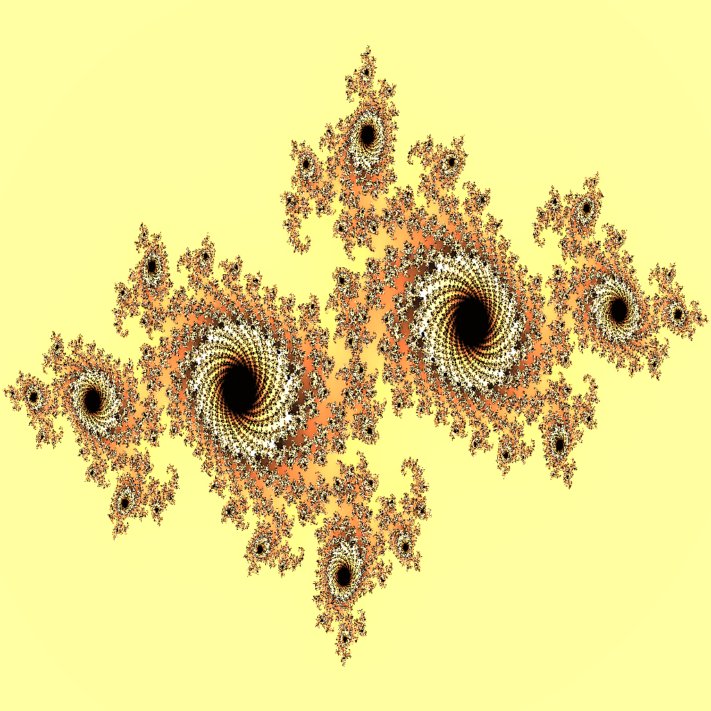

<div align="center">

  <h1><code>wasm-fractals</code></h1>

  <strong>Interactive fractal generating app using NPM packages containing Rust-generated WebAssembly bundled with Webpack.</strong>

  

  <sub>Built with 🦀🕸</sub>
</div>


## Usage

```
npm init wasm-app
```

You can also use it here: https://jumideluxe.github.io/wasm-fractals/